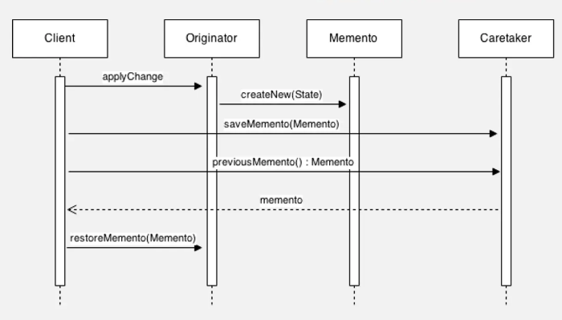

# M E M E N T O

## Introduzione

Questo progetto è un esempio di implementazione del Memento Pattern in Go. Il Memento Pattern è un pattern di progettazione comportamentale che permette di catturare e salvare lo stato interno di un oggetto in modo che possa essere ripristinato in un secondo momento senza esporre i dettagli interni dell'oggetto stesso.

## Sequenza Temporale

Di seguito è descritta la sequenza temporale delle operazioni eseguite durante l'uso del Memento Pattern:

1. **Creazione degli Oggetti**
- Viene creato un `Person` e un `Server` tramite il modulo `utils`.
- Un `Originator` viene creato con lo stato iniziale impostato sul `Server`.
- Viene creato un `Caretaker` per gestire i `Memento`.

2. **Applicazione di una Modifica (applyChange)**
- Il client (nel contesto del `main`) applica una modifica allo stato dell'`Originator` utilizzando il metodo `applyChange`.
- Questa modifica simula un cambiamento nello stato del `Server`.

3. **Salvataggio dello Stato Corrente (saveToMemento)**
- Dopo aver applicato la modifica, l'`Originator` salva lo stato corrente creando un `Memento`.
- Il `Memento` cattura lo stato attuale del `Server` (o di qualsiasi altro stato contenuto nell'`Originator`).

4. **Memorizzazione del Memento (addMemento)**
- Il `Memento` creato viene passato al `Caretaker`.
- Il `Caretaker` memorizza il `Memento` in una lista per una possibile futura consultazione o ripristino.

5. **Ripristino dello Stato Precedente (restoreFromMemento)**
- Successivamente, il client decide di ripristinare lo stato precedente.
- Il `Client` chiede al `Caretaker` di fornire un `Memento` precedentemente salvato.
- Il `Caretaker` recupera il `Memento` dalla sua lista e lo restituisce all'`Originator`.
- L'`Originator` utilizza il `Memento` per ripristinare il proprio stato al momento in cui il `Memento` è stato creato.

6. **Log dello Stato Ripristinato**
- Viene eseguito il log dello stato ripristinato del `Server` per verificare che il ripristino sia avvenuto correttamente.
- Il progetto utilizza il pacchetto `structs` per convertire lo stato in una mappa prima di eseguire il log, il che facilita la visualizzazione e il debug.

## Diagramma di Sequenza



## Approfondimenti

1.Memento
Il termine **"Memento"** deriva dal latino e significa "ricordo". Nel contesto del pattern, un Memento è un oggetto che memorizza lo stato interno di un altro oggetto.
Il Memento è responsabile del mantenimento dello stato di un oggetto senza esporre i dettagli di implementazione del suddetto stato. Questo consente di ripristinare lo stato dell'oggetto originario in un momento successivo.
```go
type Memento[T any] struct {
State T
}
```
In questo codice, Memento[T any] è una struttura generica che memorizza lo stato di tipo T.

2. Originator
**"Originator"** significa "colui che origina" o "colui che crea". È l'oggetto il cui stato vogliamo salvare e ripristinare.
L'Originator è l'oggetto principale che mantiene uno stato e che può creare un Memento per salvare il proprio stato o ripristinarlo da un Memento esistente. Questo oggetto conosce tutti i dettagli del suo stato e può decidere quando e come creare o utilizzare un Memento.

```go
type Originator[T any] struct {
State T
}
```

In questo codice, Originator[T any] è una struttura generica che contiene lo stato di tipo T. Le funzioni saveToMemento e restoreFromMemento permettono di salvare e ripristinare lo stato usando il Memento.

3. Caretaker
**"Caretaker"** significa "custode" o "colui che si prende cura". Questo riflette il ruolo dell'oggetto nella gestione dei memento.
Il Caretaker è responsabile della gestione dei Memento, ma non conosce e non manipola direttamente il contenuto dello stato memorizzato. Il suo compito principale è quello di memorizzare i memento e di gestire la loro cronologia (ad esempio, per implementare funzionalità di "undo/redo").

```go
type Caretaker[T any] struct {
mementos []Memento[T]
}

```

Nel codice, Caretaker[T any] è una struttura generica che gestisce una collezione di Memento[T]. Le funzioni addMemento e getMemento permettono di aggiungere e recuperare memento rispettivamente.


## Quanto usarlo?

- **Undo/Redo:** Quando vuoi permettere agli utenti di annullare o ripristinare le azioni, come in un editor di testo.
- **Salvataggio di Giochi:** Per salvare e ripristinare lo stato di un gioco, mantenendo tutte le posizioni e punteggi intatti.
- **Ripristino in Caso di Errore:** Per memorizzare lo stato corrente di un sistema o transazione e ripristinarlo in caso di problemi.